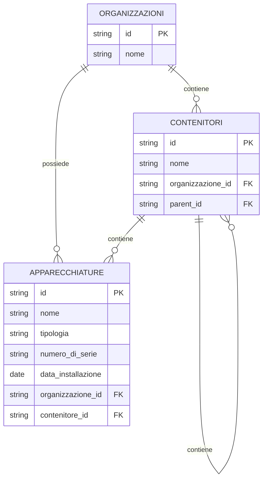

# Anagrafica Radiologica

Applicazione **full‑stack** per la gestione di un’anagrafica radiologica con:

- **albero organizzativo** (Organizzazione → Contenitori → …) consultabile via API e frontend;
- **creazione/gestione Apparecchiature** radiologiche con validazioni di business (es. seriale univoco, data non futura, coerenza con organizzazione/contenitore).

## Build e avvio - fast

```powershell
# Posizionarsi nella root del progetto
cd H:\cyberqual\anagrafica-radiologica

# Installare PostgreSQL 
1. Scaricare l'installer da https://www.postgresql.org/download
2. Installare con le opzioni predefinite (porta 5432, password `postgres`)
3. **Non selezionare Stack Builder** al termine dell'installazione → deselezionare e cliccare Finish

# Aprire pgAdmin o psql ed eseguire query
CREATE DATABASE anagrafica_radiologica;
-- Le tabelle vengono create automaticamente dallo schema.sql all'avvio
Dopodichè eseguire anche lo script db-data-init.sql per inizializzare i dati delle tabelle db

# Prima volta: generare il Maven wrapper
mvn -N wrapper:wrapper

# Build completa e avvio BE in locale (con Tomcat embedded)
.\mvnw.cmd spring-boot:run

# Avvio FE in locale
cd frontend
npm run dev

# Autenticazione
al prompt sul browser, inserire utente ADMIN, password ADMIN per pieni privilegi
```

## Avvio fast con docker image

````
# Pull e avvio docker image ultima release
git clone https://github.com/s277945/anagrafica-radiologica.git
cd anagrafica-radiologica

docker compose -f docker-compose.release.yml up -d --pull always

# Aprire pagina FE
http://localhost:8080/anagrafica/
````

## Indice

1. [Panoramica e architettura](#panoramica-e-architettura)
    - [Runtime e routing](#runtime-e-routing)
2. [Scelte tecnologiche](#scelte-tecnologiche)
    - [Backend](#backend)
    - [Frontend](#frontend)
3. [Prerequisiti](#prerequisiti)
4. [Setup Ambiente e Istruzioni di Installazione](#0-setup-ambiente-e-istruzioni-di-installazione)
    - [Prerequisiti](#01-prerequisiti)
    - [Installazione Java 21 Windows](#installazione-java-21-windows)
    - [Configurazione JAVA_HOME](#configurazione-java_home-se-maven-non-trova-il-jdk)
    - [Installazione PostgreSQL Windows](#installazione-postgresql-windows)
    - [Configurazione Database](#02-configurazione-database)
    - [Configurazione IDE IntelliJ IDEA](#03-configurazione-ide-intellij-idea-202613)
    - [Build e Avvio](#04-build-e-avvio)
    - [Esecuzione Test](#05-esecuzione-test)
    - [Deploy su Tomcat 10.1+](#06-deploy-su-tomcat-101)
    - [Troubleshooting setup](#07-troubleshooting)
5. [Scelte Tecnologiche dettagliate](#1-scelte-tecnologiche)
6. [Approccio API-First OpenAPI](#2-approccio-api-first-openapi)
    - [Principio](#principio)
    - [Vantaggi](#vantaggi)
    - [Flusso di build](#flusso-di-build)
7. [Modello Dati e Gerarchia](#3-modello-dati-e-gerarchia)
    - [Strategia: Adjacency List con parent_id](#strategia-adjacency-list-con-parent_id)
    - [Schema ER](#schema-er)
8. [Sicurezza](#4-sicurezza)
9. [Testing](#5-testing)
    - [Approccio](#approccio)
10. [DevOps e Packaging](#6-devops-e-packaging)
    - [Strategia: WAR unico](#strategia-war-unico)
    - [Pipeline CI/CD GitHub Actions](#pipeline-cicd-github-actions)
    - [Deploy](#deploy)
11. [Frontend](#7-frontend)
12. [Docker Compose](#docker-compose)
13. [API-first e OpenAPI](#api-first-e-openapi)
14. [Modello dati e gerarchia](#modello-dati-e-gerarchia)
15. [Dati, validazioni e anagrafica radiologica](#dati-validazioni-e-anagrafica-radiologica)
    - [Creazione Apparecchiatura](#creazione-apparecchiatura)
16. [Struttura dati JPA Entities, relazioni, DTO/API model](#struttura-dati-jpa-entities-relazioni-dtoapi-model)
    - [Entità principali](#entità-principali)
    - [Cardinalità e vincoli concettuali](#cardinalità-e-vincoli-concettuali)
    - [DTO / OpenAPI model request/response](#dto--openapi-model-requestresponse)
    - [Flusso applicativo Entity → Service → DTO → API → Frontend](#flusso-applicativo-entity--service--dto--api--frontend)
17. [Frontend React/Vite/TypeScript](#frontend-reactvitetypescript)
18. [Configurazione e variabili d’ambiente](#configurazione-e-variabili-dambiente)
    - [Backend](#backend-1)
    - [Frontend](#frontend-1)
19. [Test](#test)
    - [Backend](#backend-2)
    - [Frontend](#frontend-2)
20. [Troubleshooting](#troubleshooting)
    - [Porta 8080/5432 occupata](#porta-80805432-occupata)
    - [Errore di connessione al DB](#errore-di-connessione-al-db)
    - [Swagger UI non raggiungibile](#swagger-ui-non-raggiungibile)
    - [Client API non aggiornato frontend](#client-api-non-aggiornato-frontend)
21. [DevOps / Packaging WAR](#devops--packaging-war)
22. [Gitignore](#gitignore)
23. [Licenza](#licenza)

## Panoramica e architettura

Il progetto è composto da:

- **Backend**: Spring Boot (Java 21) + JPA/Hibernate + PostgreSQL, API documentate con OpenAPI/Swagger.
- **Frontend**: React + Vite + TypeScript, data-fetching con **TanStack Query**, client API generato da **Kubb** a partire dallo YAML OpenAPI del backend.

### Runtime e routing

- Il backend (Java/Spring Boot) espone endpoint REST sotto `/api/**` (con `server.servlet.context-path=/anagrafica`, quindi a runtime: `/anagrafica/api/**`).
- Il frontend (Vite/React) consuma le API tramite client generato (Kubb) e gestisce cache/invalidation con TanStack Query.
- Persistenza su PostgreSQL. In sviluppo è prevista anche la possibilità di H2 console (abilitata nelle regole di sicurezza), ma la configurazione principale è PostgreSQL.

---


## Scelte tecnologiche

### Backend

- Java **21**
- Spring Boot **3.3.2**
- Spring Web, Spring Data JPA (Hibernate)
- Spring Security (Basic Auth, utenti **in-memory**)
- `springdoc-openapi` / Swagger UI
- Database: PostgreSQL (docker-compose: `postgres:16-alpine`)
- Packaging: **WAR** (vedi `pom.xml`)

### Frontend

- React **18**
- Vite **5**
- TypeScript **5**
- **@tanstack/react-query** (TanStack Query v5)
- Client API generato con **Kubb**
- Test: **Vitest** (script `npm run test`, `npm run coverage`)

---

## Prerequisiti

### Windows

- **Git**
- **JDK 21** (consigliato Temurin/Adoptium)
- **Maven** (opzionale: è incluso Maven Wrapper `mvnw.cmd`)
- **Node.js** (consigliato LTS) + npm
- **Docker Desktop** (per database e/o stack completo via Compose)

## 0. Setup Ambiente e Istruzioni di Installazione

### 0.1 Prerequisiti

| Software | Versione | Note |
|----------|----------|------|
| **Java JDK** | 21 LTS | Eclipse Temurin consigliato (scaricabile da IntelliJ 2026.1.3: File → Project Structure → SDKs → + → Download JDK) |
| **Maven** | 3.9.9+ | Incluso come wrapper (`mvnw`/`mvnw.cmd`) nel progetto. Per generarlo: `mvn -N wrapper:wrapper` |
| **PostgreSQL** | 15+ | Database relazionale |
| **Node.js** | 20.x | Scaricato automaticamente dal `frontend-maven-plugin` (non serve installazione manuale) |

#### Installazione Java 21 (Windows)
1. Aprire IntelliJ IDEA 2026.1.3
2. **File → Project Structure → Platform Settings → SDKs**
3. Cliccare **"+" → Download JDK…**
4. Selezionare **Version: 21**, Vendor: **Eclipse Temurin (Adoptium)**
5. Confermare e scaricare
6. Impostare come Project SDK

#### Configurazione JAVA_HOME (se Maven non trova il JDK)
```powershell
# Verificare il path del JDK scaricato da IntelliJ
Get-ChildItem "$env:USERPROFILE\.jdks"

# Impostare JAVA_HOME (sessione corrente)
$env:JAVA_HOME = "C:\Users\<utente>\.jdks\temurin-21.0.11"
$env:Path = "$env:JAVA_HOME\bin;$env:Path"

# Renderlo permanente
[System.Environment]::SetEnvironmentVariable("JAVA_HOME", "C:\Users\<utente>\.jdks\temurin-21.0.11", "Machine")
```

#### Installazione PostgreSQL (Windows)
1. Scaricare l'installer da https://www.postgresql.org/download/windows/
2. Installare con le opzioni predefinite (porta 5432, password `postgres`)
3. **Non selezionare Stack Builder** al termine dell'installazione → deselezionare e cliccare Finish

### 0.2 Configurazione Database

```sql
-- Aprire pgAdmin o psql
CREATE DATABASE anagrafica_radiologica;
-- Le tabelle vengono create automaticamente dallo schema.sql all'avvio
```
Dopodichè eseguire lo script db-data-init.sql per inizializzare i dati delle tabelle db

### 0.3 Configurazione IDE (IntelliJ IDEA 2026.1.3)

#### IntelliJ Ultimate (consigliato)
Il supporto Spring Boot è integrato. Nessun plugin aggiuntivo necessario.

#### IntelliJ Community
Installare da **File → Settings → Plugins → Marketplace**:
- **Spring Boot Helper** — autocompletamento properties, icone gutter per mapping REST
- **JPA Buddy** — navigazione entità JPA, generazione DDL

#### Configurazione obbligatoria (entrambe le edizioni)
- **File → Settings → Build, Execution, Deployment → Compiler → Annotation Processors** → spuntare **"Enable annotation processing"** (necessario per Lombok)
- **File → Project Structure → Project** → impostare Project SDK su JDK 21

### 0.4 Build e Avvio

```powershell
# Posizionarsi nella root del progetto
cd H:\cyberqual\anagrafica-radiologica

# Prima volta: generare il Maven wrapper
mvn -N wrapper:wrapper

# Build completa (genera API da OpenAPI, compila backend, builda frontend, produce WAR)
.\mvnw.cmd clean package

# Avvio BE in locale (con Tomcat embedded)
.\mvnw.cmd spring-boot:run

# Generazione client API (Kubb) — **da eseguire prima di build/test frontend** per assicurare che il client sia allineato all’OpenAPI.
# Usa **Kubb** per generare client e DTO a partire dallo swagger/OpenAPI del backend.
cd frontend
npm run kubb:gen

# Avvio FE in locale
npm run dev
```

**URL di verifica:**
| Risorsa | URL |
|---------|-----|
| Frontend | http://localhost:8080/anagrafica/ |
| Swagger UI | http://localhost:8080/anagrafica/swagger-ui.html |
| OpenAPI JSON | http://localhost:8080/anagrafica/v3/api-docs |
| API base | http://localhost:8080/anagrafica/api/ |

**Esempi di chiamata:**
```bash
# GET albero (utente USER)
curl -u user:user http://localhost:8080/anagrafica/api/organizzazioni/1/tree

# POST apparecchiatura (utente ADMIN)
curl -u admin:admin -X POST http://localhost:8080/anagrafica/api/apparecchiature \
  -H "Content-Type: application/json" \
  -d '{"nome":"TAC GE Revolution","tipologia":"TAC","numeroDiSerie":"SN-001","dataInstallazione":"2024-03-15","organizzazioneId":1}'
```

### 0.5 Esecuzione Test

```powershell
# Tutti i test (unit + integration, usa H2 in-memory)
.\mvnw.cmd test

# Solo unit test
.\mvnw.cmd test -Dtest="*ServiceTest"

# Solo integration test
.\mvnw.cmd test -Dtest="*IntegrationTest"
```

I test di integrazione **backend** (JUnit/Spring Boot) usano il profilo `test` con database **H2 in-memory**: non richiedono PostgreSQL attivo.

> I test **full‑stack** (Playwright) usano invece **PostgreSQL in Docker** (vedi sezione dedicata).

### 0.6 Deploy su Tomcat 10.1+

1. Build: `.\mvnw.cmd clean package -DskipTests`
2. Copiare `target/anagrafica-radiologica.war` nella cartella `webapps/` di Tomcat
3. Avviare Tomcat → l'app sarà disponibile su `http://<host>:8080/anagrafica-radiologica/`

### 0.7 Troubleshooting

| Problema | Soluzione |
|----------|-----------|
| `mvn` non riconosciuto | Usare `.\mvnw.cmd` oppure installare Maven e aggiungere al PATH |
| `release version 21 not supported` | Impostare `JAVA_HOME` sul JDK 21 (vedi sezione 0.1) |
| `npm ci` fallisce per mancanza di `package-lock.json` | Eseguire `cd frontend && npm install` poi ripetere il build |
| Connessione DB rifiutata | Verificare che PostgreSQL sia attivo e il database `anagrafica_radiologica` esista |
| Porta 8080 occupata | Aggiungere `server.port=8081` in `application.yml` |

---

## 1. Scelte Tecnologiche

| Componente | Scelta | Motivazione |
|------------|--------|-------------|
| Linguaggio | **Java 21 LTS** | Ultima versione LTS; supporto a record, pattern matching, text blocks, virtual threads |
| Framework | **Spring Boot 3.3.2** | Standard de facto per microservizi Java enterprise; ecosistema maturo |
| API Design | **OpenAPI 3.0 + openapi-generator-maven-plugin** | Approccio API-first: il contratto YAML è la single source of truth; interfacce e DTO generati automaticamente |
| Documentazione API | **springdoc-openapi 2.6 + Swagger UI** | UI interattiva per esplorare e testare gli endpoint, generata dal contratto |
| Database | **PostgreSQL 15** | Affidabilità, supporto nativo a CTE ricorsive (`WITH RECURSIVE`), indici avanzati |
| ORM | **Spring Data JPA / Hibernate** | Produttività; mapping dichiarativo delle entità |
| Sicurezza | **Spring Security** (HTTP Basic + utenti in-memory) | Simulazione ruoli ADMIN/USER senza complessità OAuth2 |
| Build | **Maven + frontend-maven-plugin** | Build unificata backend+frontend → singolo WAR |
| Frontend | **React 18 + TypeScript + Vite** | Tipizzazione statica, build veloce, componente tree-view ricorsivo |
| Packaging | **WAR** | Compatibile con application server aziendali (Tomcat 10.1+, WildFly 27+) |
| Test | **JUnit 5 + Mockito + MockMvc + H2** | Unit test isolati + integration test con DB in-memory |

---

## 2. Approccio API-First (OpenAPI)

### Principio
Il contratto API è definito nel file `src/main/resources/openapi/api.yaml`. Da questo file vengono generate automaticamente:
- **Interfacce Java** dei controller (package `com.anagrafica.radiologica.api`)
- **DTO** di request/response (package `com.anagrafica.radiologica.api.model`)

I controller implementano le interfacce generate → **il codice è sempre allineato al contratto**.

### Vantaggi
- **Single source of truth**: il YAML definisce il contratto, non il codice
- **Validazione automatica**: le constraint definite nel YAML (required, minLength, enum) diventano annotazioni Jakarta Validation
- **Swagger UI gratuita**: springdoc-openapi espone automaticamente la documentazione interattiva
- **Condivisibilità**: il file YAML può essere condiviso con team frontend, QA, partner esterni
- **Generazione client**: dallo stesso YAML è possibile generare client TypeScript, Python, ecc.

### Flusso di build
```
api.yaml → openapi-generator-maven-plugin → Interfacce + DTO (target/generated-sources/)
                                                    ↓
                                     Controller implements Interface
```

---

## 3. Modello Dati e Gerarchia

### Strategia: Adjacency List con `parent_id`

La relazione ricorsiva dei Contenitori è gestita tramite **Adjacency List**: ogni record `contenitori` ha un campo `parent_id` nullable che punta al contenitore padre.

**Vantaggi:**
- Semplicità di inserimento/modifica
- Query ricorsive performanti con CTE PostgreSQL (`WITH RECURSIVE`)
- Nessun vincolo sulla profondità dell'albero

### Schema ER



---

## 4. Sicurezza

Implementazione leggera con **Spring Security**:
- **HTTP Basic Authentication** (senza complessità JWT/OAuth2)
- **Utenti in-memory**: `admin/admin` (ADMIN), `user/user` (USER)
- **Autorizzazione**: `@PreAuthorize("hasRole('ADMIN')")` sugli endpoint POST
- **Swagger UI/OpenAPI docs**: accesso pubblico (permitAll)

---

## 5. Testing

| Tipo | Framework / Tooling | Cosa testa | DB / Runtime |
|------|----------------------|------------|--------------|
| **Unit (backend)** | JUnit 5 + Mockito | Service layer (logica di business isolata) | Nessuno (mock) |
| **Integration (backend)** | Spring Boot Test + MockMvc | Endpoint REST end-to-end, sicurezza, persistenza | H2 in-memory |
| **Unit / Component (frontend)** | Vitest + Testing Library + `jsdom` + `@testing-library/jest-dom` | Componenti React, hook e logica UI (rendering, eventi, stati) | Browser DOM simulato (`jsdom`) |
| **Integration (full‑stack E2E)** | Playwright + Docker Compose dedicato | Flusso **frontend + backend + PostgreSQL** (UI → API → DB) con dati seed dedicati | Container Docker (PostgreSQL + backend + frontend) |

### Approccio

- **Unit test (backend)**: verificano la logica di business isolando le dipendenze con mock (repository, altri service).
- **Integration test (backend)**: verificano il flusso completo **HTTP → Controller → Service → Repository → DB**, inclusi i vincoli di sicurezza (ruoli ADMIN vs USER) usando **H2 in-memory**.
- **Unit/Component test (frontend)**: verificano componenti e logica UI con **Vitest** e **Testing Library** in ambiente **`jsdom`**, con matchers aggiuntivi di **`@testing-library/jest-dom`** e report di **coverage**.
- **Integration test full‑stack (E2E)**: verificano il comportamento dell’app come l’utente finale, orchestrando **frontend + backend + PostgreSQL** tramite **Docker Compose** e guidando il browser con **Playwright**.

### Struttura dei test (frontend)

I test del frontend sono organizzati in cartelle dedicate (esempi):

- `frontend/src/**/__tests__/*.test.ts(x)` per unit/component test vicino al codice
- `frontend/src/**/?(*.){test,spec}.ts(x)` come alternativa (convenzione Vitest)
- `frontend/tests/` per eventuali test di supporto (helpers, fixtures, mock)

Script principali (da `frontend/`):

```bash
npm run test          # esegue Vitest in watch/CI mode (a seconda della configurazione)
npm run coverage      # genera report di coverage
```

> Nota: i test usano `jsdom` come environment e `@testing-library/jest-dom` per asserzioni DOM (es. `toBeInTheDocument`).

### Integration test full‑stack (Playwright)

Questi test validano l’intero flusso **UI → API → DB**, includendo navigazione, creazione/modifica dati e verifiche lato UI e/o via API.

Componenti principali:

- **Playwright**: test E2E e runner (`@playwright/test`)
- **Docker Compose dedicato**: stack di test isolato (frontend + backend + PostgreSQL)
- **Seed DB dedicato**: dati iniziali e coerenti per ripetibilità dei test
- **Script di orchestrazione**:
    - `scripts/integration-tests.ps1` (Windows PowerShell)
    - `scripts/integration-tests.sh` (macOS/Linux Bash)
    - `scripts/smoke-tests.ps1` (Windows PowerShell)
    - `scripts/smoke-tests.sh` (macOS/Linux Bash)

Gli script si occupano tipicamente di:
1. build immagini (se necessario) e avvio stack con `docker compose -f docker-compose.integration-tests.yml up -d --build`;
2. attesa readiness (DB e backend);
3. applicazione seed PostgreSQL;
4. esecuzione smoke test (API) e poi Playwright;
5. teardown (`docker compose ... down -v`).

#### Docker Compose di integration test

Lo stack di test è separato da quello di sviluppo per evitare collisioni di porte/volumi e garantire ripetibilità.

Esempio di flusso (concettuale):

1. `docker compose -f docker-compose.integration-tests.yml up -d --build`
2. attesa readiness servizi (DB e backend)
3. applicazione seed DB di integration test
4. esecuzione Playwright (`npx playwright test`)
5. teardown (`docker compose ... down -v`)

**File Compose:** `docker-compose.integration-tests.yml`

Punti chiave:
- stack isolato (porte/volumi dedicati) per evitare collisioni con `docker-compose.yml` di sviluppo;
- avvio servizi + healthcheck/readiness;
- applicazione seed PostgreSQL dedicato ai test;
- esecuzione Playwright;
- teardown con `down -v` per pulizia completa.

#### Seed del database (integration test)

I test full‑stack si basano su un seed dedicato per avere:

- organizzazioni/contenitori già presenti,
- utenti/ruoli disponibili per i flussi di autenticazione/autorizzazione,
- dati minimi per scenari CRUD ripetibili.

**Seed minimo richiesto (convenzioni usate nei test):**
- **Organizzazione**: `OR0000000001`
- **Contenitore**: `CO0000000001` (appartenente a `OR0000000001`)

Il seed viene applicato all’avvio dello stack di integration test (via script), così ogni run parte dallo stesso stato.

> Nota: se cambi questi identificativi nel seed, aggiorna anche le asserzioni/fixture Playwright che li utilizzano.

#### Smoke test backend (GET/POST)

Prima di eseguire gli E2E (o come parte della pipeline), viene eseguito uno **smoke test** del backend per validare che:

- una chiamata **GET** restituisca un 200 e dati attesi,
- una chiamata **POST** crei correttamente una risorsa (o fallisca con errori attesi),
- la connessione al DB sia effettivamente operativa.

Lo smoke test è pensato per fallire velocemente in caso di stack non pronto/configurazione errata, riducendo falsi negativi nei test Playwright.

### Esecuzione rapida

- **Backend (unit + integration)**:
  ```bash
  ./mvnw test
  ```

- **Frontend (unit/component)**:
  ```bash
  cd frontend
  npm ci
  npm run test
  npm run coverage
  ```

- **Full‑stack (Playwright + Docker Compose)**:
    - Windows (PowerShell): `./scripts/integration-tests.ps1`
    - macOS/Linux (Bash): `./scripts/integration-tests.sh`

---

## 6. DevOps e Packaging

### Strategia: WAR unico
Il progetto produce un **singolo file WAR** (`target/anagrafica-radiologica.war`) che include:
- Backend Java compilato
- Frontend React (buildato e copiato in `static/`)
- Tutte le dipendenze (escluso il servlet container, marcato `provided`)

### Pipeline CI/CD (GitHub Actions)
```yaml
- Checkout → Setup JDK 21 → mvn clean package → Upload WAR come artefatto
- I test vengono eseguiti nella fase `test` di Maven (H2 in-memory, nessuna dipendenza esterna)
```


#### Workflow GitHub Actions
Workflow principali (in `.github/workflows/`):
- `ci.yml` — build + test (unit/integration) e verifiche qualità.
- `integration.yml` — avvio stack Docker e **Playwright full‑stack integration test**.
- `package.yml` — packaging artefatti (WAR) e/o pubblicazione artifact.
- `docker.yml` — build & push immagine Docker applicativa.
- `deploy-dev.yml` — deploy in **DEV**.
- `deploy-uat.yml` — deploy in **UAT**.
- `deploy-prod.yml` — deploy in **PROD**.
- `release.yml` — tag/release (promozione verso stable/main secondo la strategia).

#### Branch strategy e promozione
Flusso consigliato:
- sviluppo su `feature/*`
- merge verso `snapshot` (integrazione continua)
- promozione/merge verso `stable` (candidate/release)
- promozione verso `main` (produzione)

> Le promozioni devono essere tracciabili (PR) e passare i workflow richiesti.

#### Ambienti
- **dev**: integrazione rapida, deploy frequenti.
- **uat**: validazione QA/UAT con snapshot "stabile".
- **prod**: rilascio controllato (tag/release).

#### Secrets necessari (DEV/UAT/PROD)
Tipicamente:
- credenziali registry (es. `GHCR_TOKEN`/`REGISTRY_USERNAME`/`REGISTRY_PASSWORD`)
- credenziali SSH/runner remoto (host, user, key) per deploy
- eventuali variabili applicative (DB, basic auth, ecc.) per ciascun ambiente

> Prefissi o gruppi separati per ambiente (es. `DEV_*`, `UAT_*`, `PROD_*`).

#### Gestione `APP_IMAGE` nel `.env` remoto (senza sovrascrivere le altre variabili)
Nei deploy su server remoto, aggiornare **solo** la variabile `APP_IMAGE` nel file `.env` (o file env usato dal compose), evitando di sovrascrivere altre configurazioni.
Esempio (concettuale):
- leggere il `.env` esistente;
- sostituire/aggiungere la riga `APP_IMAGE=...`;
- lasciare inalterate tutte le altre variabili.

#### Branch protection e flusso operativo
- abilitata branch protection su `snapshot`, `stable`, `main`:
    - status checks obbligatori (workflow CI/integration/package/docker)
    - review minime (es. 1-2)
    - blocco force-push
- flusso operativo:
    1) apri PR `feature/*` → `snapshot`
    2) CI green + integration green
    3) promuovi `snapshot` → `stable` tramite PR
    4) esegui `release.yml`/tag e promuovi `stable` → `main`

### Deploy
Il WAR è deployabile su qualsiasi servlet container compatibile Jakarta EE 10:
- Apache Tomcat 10.1+
- WildFly 27+
- Il `SpringBootServletInitializer` garantisce il bootstrap corretto in ambiente application server

---

## 7. Frontend

- **React 18 + TypeScript + Vite**: componente `TreeView` ricorsivo che visualizza la gerarchia
- **Espandibile/comprimibile**: ogni nodo contenitore è un toggle
- **Autenticazione**: header HTTP Basic verso il backend
- **Integrato nel WAR**: il build Vite produce `dist/` che viene copiato in `src/main/resources/static` durante il Maven build

## Docker Compose

Per avviare **database + applicazione** (backend containerizzato):

```bash
docker compose up --build
```

Servizi:

- `db`: PostgreSQL 16
- `app`: immagine costruita da `Dockerfile` (esegue la WAR con `java -jar`)

Variabili usate dal servizio `app` (vedi `docker-compose.yml`):

- `SPRING_DATASOURCE_URL=jdbc:postgresql://db:5432/anagrafica_radiologica`
- `SPRING_DATASOURCE_USERNAME=postgres`
- `SPRING_DATASOURCE_PASSWORD=postgres`

---

## API-first e OpenAPI

L’approccio è **API-first**:

- il backend pubblica la specifica OpenAPI (Swagger);
- il frontend genera il client tipizzato a partire dalla specifica usando **Kubb**.

Comandi utili (frontend):

```bash
npm run kubb:gen
```

Percorsi utili:

- Specifica/OpenAPI e Swagger UI: vedi sezione [Build e avvio (locale)](#build-e-avvio-locale).

---

## Modello dati e gerarchia

Concetti principali:

- **Organizzazione**: nodo radice dell’albero.
- **Contenitori** (o unità organizzative/strutturali): nodi gerarchici associati all’organizzazione.
- **Apparecchiature**: entità “foglia” associata a un nodo (organizzazione/contenitore) e soggetta a regole di business.

La gerarchia è esposta via API e rappresentata anche a frontend.

> Se nel progetto sono presenti migrazioni/schema o entità JPA, fare riferimento al package `src/main/java` e alle classi `@Entity` per i dettagli puntuali.

---

## Dati, validazioni e “anagrafica radiologica”

### Creazione Apparecchiatura
La logica è in `ApparecchiaturaService#create` e applica:
- **dataInstallazione non futura** (se presente),
- **numeroDiSerie univoco** (409 se duplicato),
- **organizzazioneId obbligatorio**: deve esistere,
- `contenitoreId` opzionale: se presente deve esistere **e** appartenere alla stessa organizzazione.

L’ID dell’apparecchiatura viene generato con prefisso (es. `"AP..."`) tramite `PrefixedIdGenerator`.

---

### Struttura dati (JPA Entities, relazioni, DTO/API model)

Questa sezione dettaglia il **modello dati** in termini di **entità JPA**, **relazioni** e **contratti DTO/OpenAPI** usati per request/response. Il modello è pensato per rappresentare un **albero organizzativo** (Organizzazione → Contenitori → …) e collegare le **Apparecchiature** ai nodi della gerarchia.

#### Entità principali

- **`OrganizzazioneEntity`**
    - Rappresenta il **nodo radice** dell’albero.
    - Identificativo “business” opzionalmente prefissato con `OR` (es. `OR001`) se coerente con la convenzione del progetto.
    - Relazioni:
        - `@OneToMany(mappedBy = "organizzazione")` verso i **contenitori**.
        - `@OneToMany(mappedBy = "organizzazione")` verso le **apparecchiature** (collegamento diretto all’organizzazione).

- **`ContenitoreEntity`**
    - Rappresenta un nodo **gerarchico** appartenente a una specifica organizzazione.
    - Identificativo “business” opzionalmente prefissato con `CO` (es. `CO010`) se coerente con la convenzione del progetto.
    - Relazioni:
        - `@ManyToOne` verso `OrganizzazioneEntity` (FK `organizzazione_id`, obbligatoria).
        - **Self‑reference** per la gerarchia dei contenitori:
            - `parent_id` (FK verso `ContenitoreEntity`, **nullable** per i nodi di primo livello).
            - `@ManyToOne` verso il **parent** (`ContenitoreEntity parent`).
            - `@OneToMany(mappedBy = "parent")` verso i **children** (`List<ContenitoreEntity> children`).
        - `@OneToMany(mappedBy = "contenitore")` verso le **apparecchiature** (collegamento opzionale).

- **`ApparecchiaturaEntity`**
    - Rappresenta l’entità “foglia” con attributi anagrafici/tecnici (es. matricola/seriale, modello, produttore, date, ecc.).
    - Identificativo “business” opzionalmente prefissato con `AP` (es. `AP100`) se coerente con la convenzione del progetto.
    - Relazioni:
        - `@ManyToOne` verso `OrganizzazioneEntity` (FK `organizzazione_id`, **obbligatoria**): ogni apparecchiatura appartiene sempre a una organizzazione.
        - `@ManyToOne(optional = true)` verso `ContenitoreEntity` (FK `contenitore_id`, **opzionale**): l’apparecchiatura può essere agganciata a un contenitore specifico oppure solo all’organizzazione.

#### Cardinalità e vincoli (concettuali)

- **Organizzazione → Contenitori**: `1 -> N` (una organizzazione contiene molti contenitori).
- **Contenitore → Sotto‑contenitori**: `1 -> N` con **self‑referencing** via `parent_id`.
- **Organizzazione → Apparecchiature**: `1 -> N`.
- **Contenitore → Apparecchiature**: `1 -> N` (opzionale lato apparecchiatura).

Vincoli tipici (coerenti con le regole di business descritte nel README):

- `organizzazione_id` **non nullo** su `ContenitoreEntity` e `ApparecchiaturaEntity`.
- `contenitore_id` **nullable** su `ApparecchiaturaEntity`.
- Se `contenitore_id` è valorizzato, allora il contenitore deve appartenere alla **stessa organizzazione** dell’apparecchiatura.
- Unicità su campi di dominio (ad es. **seriale/matricola univoca**), se prevista dalle validazioni.
- Validazioni su date (ad es. **data non futura**) e coerenenza dei dati anagrafici.

> Nota: i nomi delle colonne/FK possono variare (es. `organization_id` vs `organizzazione_id`). L’intento qui è descrittivo; per i dettagli puntuali fare riferimento alle `@Entity` e/o alle migrazioni.

#### DTO / OpenAPI model (request/response)

L’applicazione segue un approccio **API‑first**: i modelli esposti sono definiti nello **schema OpenAPI** e generano (o guidano) i DTO usati nelle request/response.

Tipicamente:

- **DTO di output** (read model)
    - `OrganizzazioneDto` / `OrganizzazioneResponse` (id, nome, metadati, …)
    - `ContenitoreDto` (id, nome, `parentId`, `children` o struttura ad albero, …)
    - `ApparecchiaturaDto` (id, seriale, dati anagrafici, `organizzazioneId`, `contenitoreId` opzionale, …)

- **DTO di input** (create/update)
    - `Create/UpdateOrganizzazioneRequest`
    - `Create/UpdateContenitoreRequest` (incluso `parentId` opzionale)
    - `Create/UpdateApparecchiaturaRequest` (incluso `organizzazioneId` obbligatorio e `contenitoreId` opzionale)

I nomi esatti dipendono dal file OpenAPI e dall’eventuale generazione del client; l’idea è mantenere separate:

- **Entity JPA** (persistenza)
- **DTO OpenAPI** (contratto esterno)

#### Flusso applicativo (Entity → Service → DTO → API → Frontend)

Il flusso tipico delle operazioni (CRUD e consultazione gerarchia) è:

1. **Controller/API layer** (Spring MVC / Web)
    - Riceve la request con un **DTO OpenAPI** (es. `CreateApparecchiaturaRequest`).
2. **Service layer**
    - Applica **validazioni di business** (es. seriale univoco, data non futura, coerenza organizzazione↔contenitore).
    - Esegue lookup e persistenza tramite repository JPA.
3. **Repository layer (JPA)**
    - Salva/legge `OrganizzazioneEntity`, `ContenitoreEntity`, `ApparecchiaturaEntity`.
4. **Mapping Entity ↔ DTO**
    - Converte l’entity in DTO di response (es. `ApparecchiaturaDto`) e viceversa.
5. **API response**
    - Restituisce DTO conformi all’OpenAPI.
6. **Frontend**
    - Consuma le API tramite client generato o wrapper; rende l’albero (organizzazione/contenitori) e le apparecchiature collegate.

---

## Frontend (React/Vite/TypeScript)

Caratteristiche:

- **React + TypeScript** per UI e typing forte
- **TanStack Query** per cache, refetch, invalidation e gestione stato server
- **Kubb** per generare un client API tipizzato a partire da OpenAPI (riduce boilerplate e drift tra backend e frontend)

Struttura e configurazioni specifiche sono nella cartella `frontend/`.

---

## Configurazione e variabili d’ambiente

### Backend

Le proprietà principali possono essere impostate via:

- `application.properties` / `application.yml`
- variabili d’ambiente Spring Boot (es. `SPRING_DATASOURCE_*`)

Esempio (usato in Docker Compose):

```bash
export SPRING_DATASOURCE_URL="jdbc:postgresql://localhost:5432/anagrafica_radiologica"
export SPRING_DATASOURCE_USERNAME="postgres"
export SPRING_DATASOURCE_PASSWORD="postgres"
```

### Frontend

Vite supporta `.env`, `.env.local`, ecc. (vedi sezione [Gitignore](#gitignore)).

Esempio tipico (se previsto dal progetto) è una variabile tipo:

- `VITE_API_BASE_URL=...`

> Nota: verifica i nomi effettivi delle variabili leggendo `frontend/` (es. `src/config` o file equivalenti) se presenti.

---

## Test

### Backend

```bash
./mvnw test
```

### Frontend (unit/component) — Vitest

Da `frontend/`:

```bash
npm run test
npm run coverage
```

### Full‑stack (Playwright) — integration test

- Windows (PowerShell): `./scripts/integration-tests.ps1`
- macOS/Linux (Bash): `./scripts/integration-tests.sh`


---

## Integration test full-stack (frontend + backend + database)

Questa repo include **integration test end-to-end** che avviano un ambiente completo con **PostgreSQL + backend + frontend** via Docker Compose e poi eseguono test **Playwright** contro l’app.

### Prerequisiti
- Docker / Docker Compose
- Node.js + npm (per eseguire Playwright dal progetto `frontend`)

### Avvio ed esecuzione (comandi speciali)

**Windows (PowerShell)**:
- Esecuzione headless (default):
  ```powershell
  ./scripts/integration-tests.ps1
  ```
- UI runner Playwright:
  ```powershell
  ./scripts/integration-tests.ps1 -UI
  ```
- Modalità headed (browser visibile):
  ```powershell
  ./scripts/integration-tests.ps1 -Headed
  ```

**Linux/macOS (bash)**:
- Headless:
  ```bash
  ./scripts/integration-tests.sh
  ```
- UI:
  ```bash
  ./scripts/integration-tests.sh ui
  ```
- Headed:
  ```bash
  ./scripts/integration-tests.sh headed
  ```

In alternativa puoi gestire manualmente:
1. Avviare l’ambiente:
   ```bash
   docker compose -f docker-compose.integration-tests.yml up -d --build
   ```
2. Lanciare i test dal frontend:
   ```bash
   cd frontend
   npm ci
   npx playwright install --with-deps
   npm run test:integration
   ```
3. Spegnere:
   ```bash
   docker compose -f docker-compose.integration-tests.yml down -v
   ```

### Struttura file per integration test
- `docker-compose.integration-tests.yml`: compose dedicato agli integration test (db + backend + frontend).
- `scripts/integration-tests.ps1`: runner PowerShell che avvia/ferma l’ambiente ed esegue Playwright.
- `scripts/integration-tests.sh`: runner bash equivalente.
- `frontend/playwright.config.ts`: configurazione Playwright (report HTML, trace on first retry).
- `frontend/tests/integration/fullstack.spec.ts`: test effettivi:
    - caricamento app
    - caricamento albero organizzazione
    - creazione apparecchiatura con seriale univoco

---

## Troubleshooting

### Porta 8080/5432 occupata

- Cambia la porta nel `docker-compose.yml` o chiudi il processo che la sta usando.
- Per PostgreSQL, puoi mappare ad esempio `5433:5432`.

### Errore di connessione al DB

- Se sei in locale: verifica host/porta e credenziali.
- Se sei in Docker: usa `db` come hostname (come da Compose) e attendi l’healthcheck.

### Swagger UI non raggiungibile

- Verifica il `context-path` `/anagrafica`.
- URL atteso: `http://localhost:8080/anagrafica/swagger-ui/index.html`

### Client API non aggiornato (frontend)

- Rigenera il client con:

```bash
npm run kubb:gen
```

---

## DevOps / Packaging WAR

Il progetto backend è configurato con packaging **WAR** (`<packaging>war</packaging>` in `pom.xml`).

Comandi:

```bash
./mvnw clean package
```

Artefatto risultante:

- `target/anagrafica-radiologica-0.0.1-SNAPSHOT.war`

Il `Dockerfile` esegue la WAR tramite:

```bash
java -jar app.war
```

---

## Gitignore

Il progetto ignora (tra gli altri):

- `node_modules/`, `dist/`
- `target/` (build Maven)
- file `.env*` locali
- log e cache tooling
- report di coverage

Vedi `.gitignore` per la lista completa.

---

## Licenza

Questo progetto è rilasciato sotto licenza **MIT**. Vedi il file [`LICENSE`](LICENSE).

